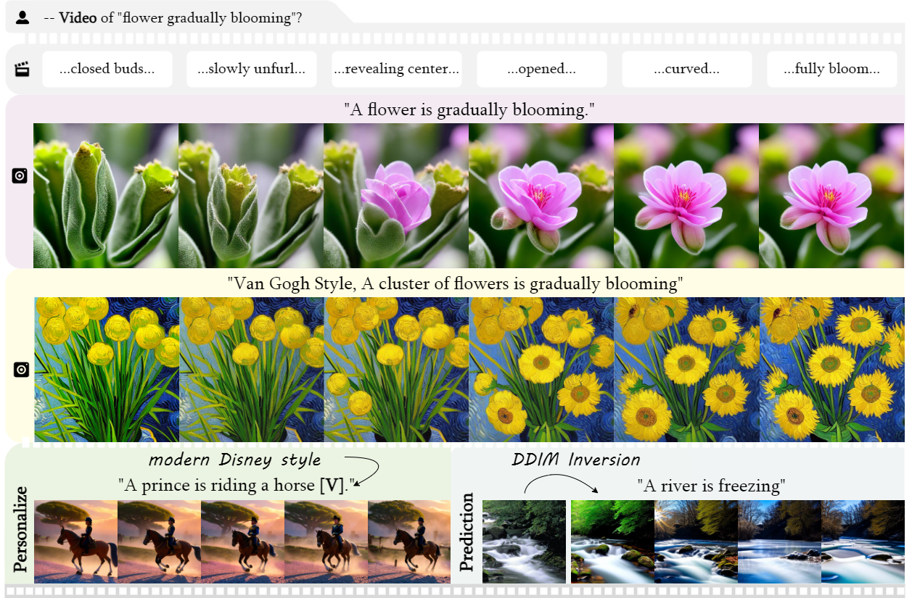
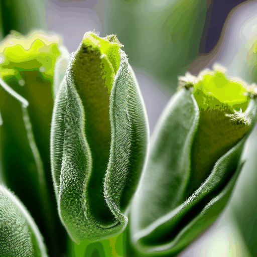
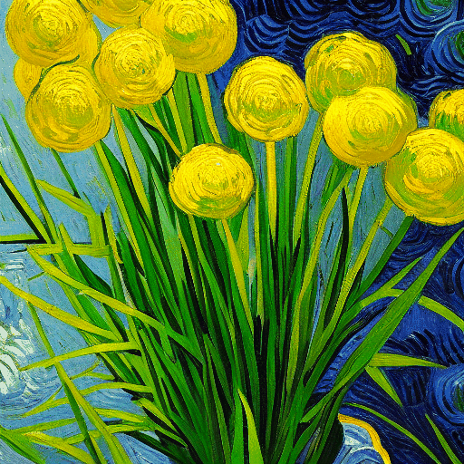
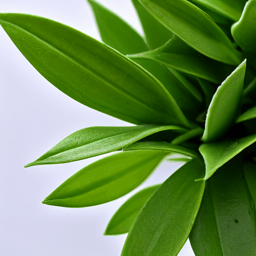
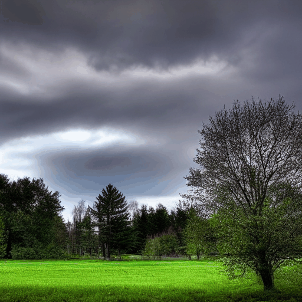

# Free-Bloom

This repository is the official implementation of [Free-Bloom](https://arxiv.org/abs/2309.14494).

**[Free-Bloom: Zero-Shot Text-to-Video Generator with LLM Director and LDM Animator](https://arxiv.org/abs/2309.14494)**

[Hanzhuo Huang∗]() , [Yufan Feng∗](), [Cheng Shi](https://chengshiest.github.io/), [Lan Xu](https://www.xu-lan.com/), [Jingyi Yu](https://vic.shanghaitech.edu.cn/vrvc/en/people/jingyi-yu/), [Sibei Yang†](https://faculty.sist.shanghaitech.edu.cn/yangsibei/)

*Equal contribution; †Corresponding Author

[](https://arxiv.org/abs/2309.14494) 




## Setup

### Requirements
```cmd
conda create -n fb python=3.10
conda activate fb
pip install -r requirements.txt
```

Installing [xformers](https://github.com/facebookresearch/xformers) is highly recommended for more efficiency and speed on GPUs. 
To enable xformers, set `enable_xformers_memory_efficient_attention=True` (default).


## Usage

### Generate
```cmd
python main.py --config configs/flowers.yaml
```

Change the path of diffusion models to your own for  the `pretrained_model_path` key in config yaml file.


## Results

**A Flower is blooming**

<table class="center">
    <tr>
    <td></td>
    <td></td>
    <td></td>
    <td></td>
    </tr>
</table>


**Volcano eruption**

<table class="center">
    <tr>
    <td></td>
    <td></td>
    <td></td>
    <td></td>
    </tr>
</table>

**A rainbow is forming**
<table class="center">
    <tr>
    <td></td>
    <td></td>
    <td></td>
    <td></td>
    </tr>
</table>


## Citation

```
@article{freebloom,
	title={Free-Bloom: Zero-Shot Text-to-Video Generator with LLM Director and LDM Animator},
	author={Huang, Hanzhuo and Feng, Yufan and Shi, Cheng and Xu, Lan and Yu, Jingyi and Yang, Sibei},
	journal={arXiv preprint arXiv:2309.14494},
	year={2023}
}
```
